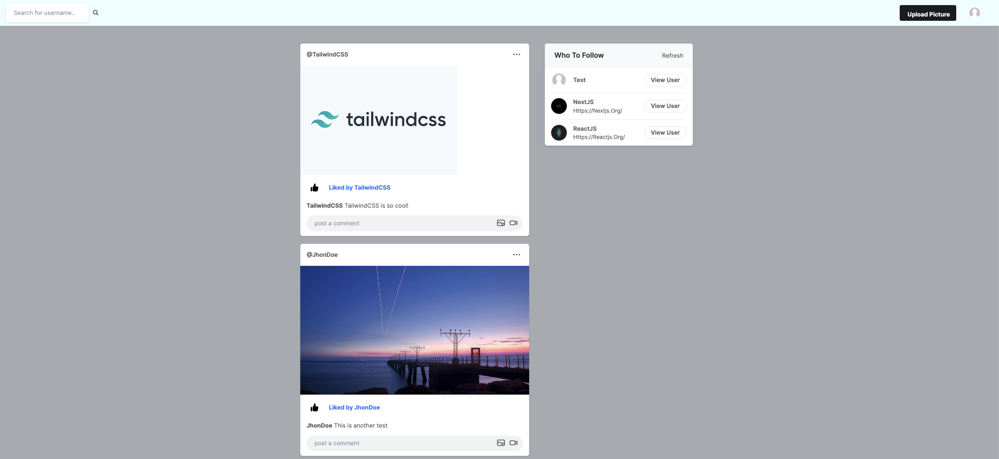

# Python Social Media Challenge

How's it going everyone! This here is a Python Social Media Challenge! I was tasked to create a very basic but funtioncal social media site using the Django framework, python, and JS. This was quite a challenge but I was able to implement a lot of features. 

**NOTE:** You can create a random account to be able to login.

## Core Features

- Image routing
- Database migration, migrating all the data to the database 
- once migrations are done, any changes made in the models.py will be saved before migrating it to the database 
- Django admin panel (where everything is being stored)
- User authentication / signup / signin
- Decorator to prohibit unauthorized access to the home page without being logged in
- Search user functionality
- Creating posts

Preview:

## Dependencies used
1. [Django](https://www.djangoproject.com/)
2. [Python](https://www.python.org/)
3. JavaScript